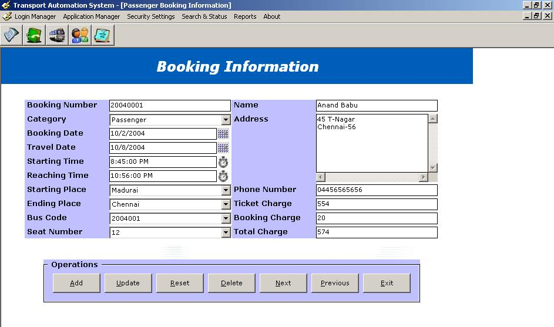



## Transport Automation System

### Description

This Helps in maintainign the booking, vechicles, contacts and other important aspects of any transport organisation.
 
### More Info
 

             |
---                |---
**Submitted On**   |2004-10-17 17:51:22
**By**             |[Poornima Prakash](https://github.com/Planet-Source-Code/PSCIndex/blob/master/ByAuthor/poornima-prakash.md)
**Level**          |Beginner
**User Rating**    |3.8 (30 globes from 8 users)
**Compatibility**  |VB 6\.0
**Category**       |[Databases/ Data Access/ DAO/ ADO](https://github.com/Planet-Source-Code/PSCIndex/blob/master/ByCategory/databases-data-access-dao-ado__1-6.md)
**World**          |[Visual Basic](https://github.com/Planet-Source-Code/PSCIndex/blob/master/ByWorld/visual-basic.md)
**Archive File**   |[Transport\_18194311182004\.zip](https://github.com/Planet-Source-Code/poornima-prakash-transport-automation-system__1-57311/archive/master.zip)

